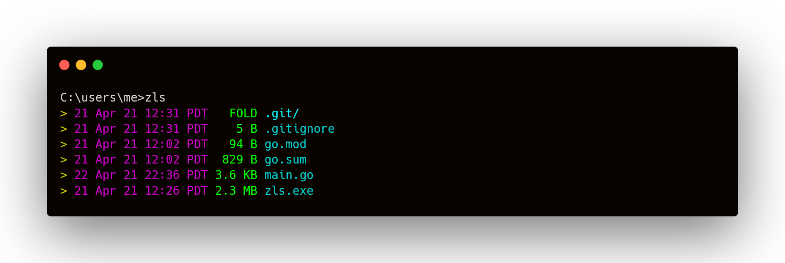

<div align="center">
<h1>zls</h1>

Super basic and super small windows file system list.


</div>

### Usage
```
 zls [version]

 USAGE:
  zls [dir] [OPTIONS]

 FLAGS:
  -c, --created		Show file/folder creation times (Windows only)
  -v, --verbose		Shows off more info
  -h, --help		  Show this help message

 ARGS:
  <dir>		Give zls a directory to list [default: .]
  
  ```
